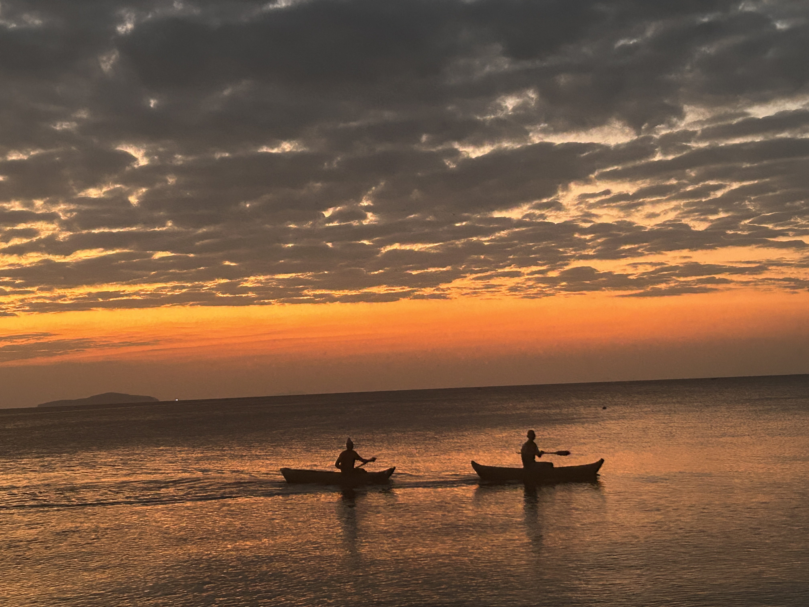

{width=250px}

Hi! I'm Nidhi Danda and I grew up in Malawi (lake Malawi shown above - the most beautiful place ever, I'm not biased I promise). I did my Bachelors in Chemistry here at UBC and graduated in May 2026. By pursuing my Masters in Data Science, I hope I can build my Computation and Quantum Chemistry skills that I gained during my last two years of research. 

This is a Quarto website.

To learn more about Quarto websites visit <https://quarto.org/docs/websites>.
